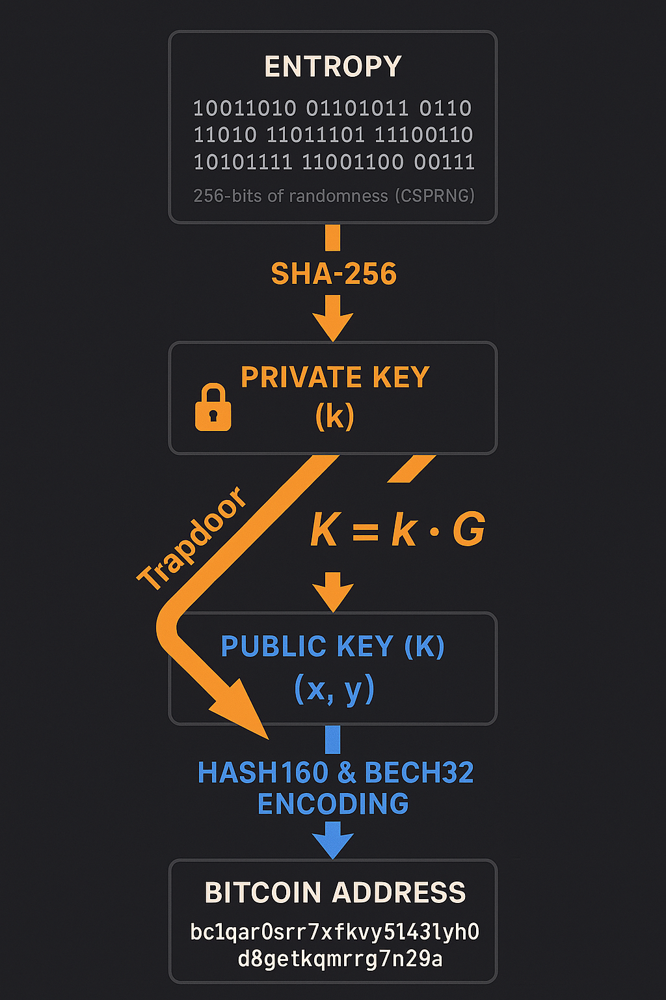

# Specification: Bitcoin Identity Derivation

## Overview
This specification illustrates the one-way cryptographic journey from high-entropy randomness to a spendable Bitcoin address. It highlights the "Trapdoor" function of elliptic curve cryptography where derivation is computationally easy in one direction but impossible to reverse.

## Technical Phases

### 1. Entropy & Private Key
- **Source:** 256-bits of randomness generated via a Cryptographically Secure Pseudo-Random Number Generator (CSPRNG).
- **Transformation:** The entropy is hashed via **SHA-256** to ensure a uniform 256-bit private key ($k$).

### 2. The secp256k1 Trapdoor
- **Operation:** Scalar multiplication of the private key ($k$) by the Generator Point ($G$).
- **Formula:** $K = k \cdot G$
- **Security:** While $K$ (Public Key) is easily calculated, finding $k$ from $K$ requires solving the Discrete Logarithm Problem, which is computationally infeasible.

### 3. Hashing & Encoding
- **HASH160:** To reduce the size of the Public Key and add an extra layer of security, the key is hashed using **SHA-256** followed by **RIPEMD-160**.
- **Bech32 Encoding:** The final hash is encoded into a human-readable format (BIP 173) to produce a **Native SegWit (bc1q...)** address, which includes a checksum to prevent transaction errors.
